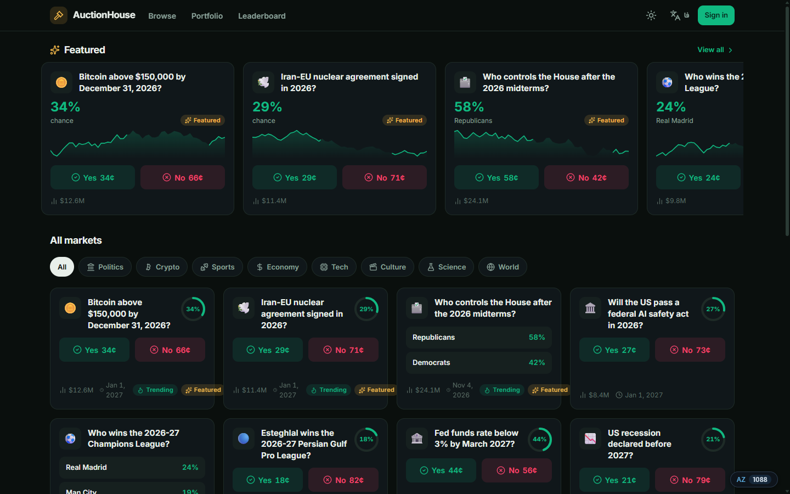
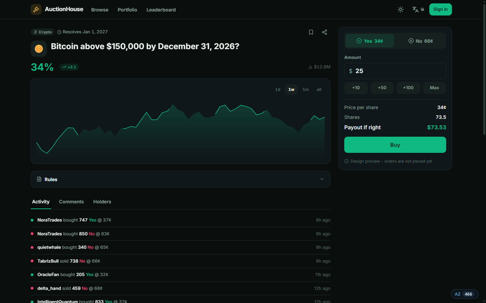
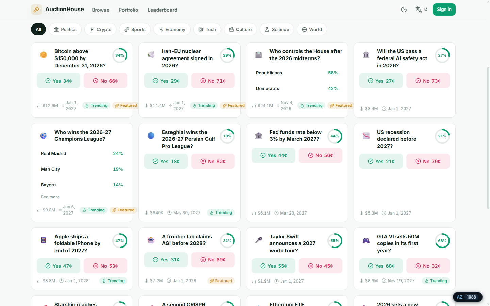
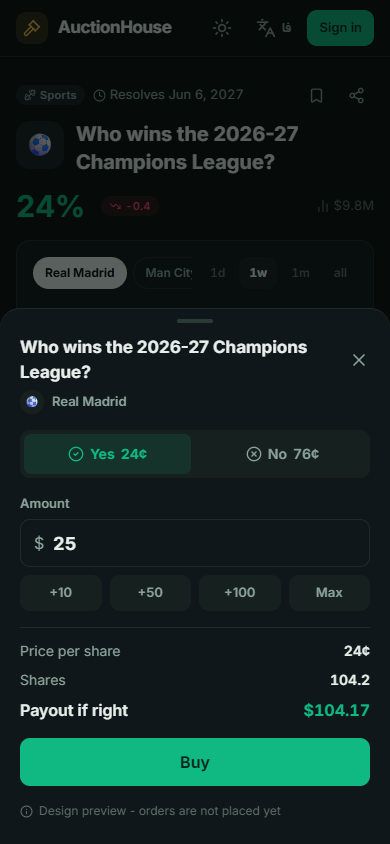
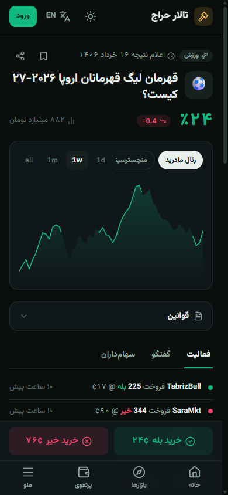

<div align="center">

# AuctionHouse

**Trade on what happens next.**

A modern, bilingual prediction-market platform: emerald and gold on ink, native on
mobile and native on desktop, English and Persian as equals.

[](https://github.com/AzerothJS/AzerothJS)
[](LICENSE)
[](https://nodejs.org)



</div>

---

## What this is

AuctionHouse is a prediction-market product in the Polymarket category, designed and
built from scratch with its own identity (the **Ledger** design system) and a fullstack
shape: compiled `.azeroth` components on the client, an `@azerothjs/http` server, and one
typed API declaration between them. This phase ships the complete UI/UX against a seeded
mock API; the real backend replaces one data module and nothing above it moves.

| | |
| --- | --- |
|  |  |
|  |  |

## The product decisions

- **Dark first, light complete.** Two full parallel color scales, flipped by one
  `data-theme` attribute. Light is a first-class theme, never a derived tint.
- **English and Persian as equals.** RTL is a first-class layout (logical properties
  everywhere), Persian gets Vazirmatn, Persian-Arabic digits, Toman amounts with real
  scale words, and Jalali dates. Charts keep Latin digits in both languages, on purpose.
- **One number module.** Every price, volume, percentage, and date renders through
  `src/i18n/format.ts`. Persian-digit bugs die in its unit tests, not in production.
- **Native on both form factors.** Mobile gets a bottom tab bar, bottom sheets with drag
  handles, a sticky trade bar, and 44px targets. Desktop gets hover, density, a sticky
  right-column trade ticket, and keyboard paths. One component, two presentations.

## UX defects we fix (that the reference category has)

1. **Stacked-modal chaos** - one auth surface, ever. Google, email, and wallet live on a
   single sheet; nothing ever opens on top of it.
2. **Tiny Yes/No chips** - full-height outcome buttons with the price on the button.
3. **Cents-vs-percent confusion** - one dual convention everywhere: a 34c share means a
   34% chance, and the market page says so in plain words.
4. **Two cramped nav rows** - one scrollable category rail; global nav lives in the
   header and the tab bar.
5. **Shrunk-desktop mobile web** - a real mobile IA instead of a scaled-down desktop.
6. **Plain-text empty states** - every empty state is designed and carries a next action.
7. **Color-only semantics** - YES/NO always travel with an icon and a label; visible
   focus rings; WCAG AA contrast in both themes.
8. **No i18n** - see above; the second language is not a translation gloss, it is native
   product copy.
9. **Buried resolution dates** - every card carries its resolve date and volume.
10. **Search as an afterthought** - browse searches both languages instantly, from either
    keyboard.

## Stack

- **[AzerothJS](https://github.com/AzerothJS/AzerothJS)** - compiled `.azeroth`
  components, fine-grained reactivity, no virtual DOM; `@azerothjs/http` server;
  `@azerothjs/schema` validation; one typed API client inferred from the server's own
  declaration.
- **Tailwind CSS v4** over the Ledger token system (CSS custom properties; the tokens are
  the single source of color, radius, and motion).
- **lucide** icon data rendered through one `<Icon>` component with an RTL mirror list.
- **Self-hosted fonts**: Inter Variable and Vazirmatn Variable. No CDN.

## Getting started

```sh
npm install
npm run dev
```

One command runs both halves: the API server on **:3000**, vite on **:5173** with `/api`
proxied. Open http://localhost:5173.

| Script | What it does |
| --- | --- |
| `npm run dev` | Server + client, one banner, hot reload on both |
| `npm run check` | Type-check (azeroth-tsc + tsc) and lint, both workspaces |
| `npm test` | Unit and component tests (vitest, happy-dom) |
| `npm run build` | Client bundle + SSR bundle + prerender |

## Project structure

```
application/            the web client (vite + azeroth compiler + tailwind)
  src/styles/           tokens.css (the Ledger system), base.css
  src/i18n/             en.ts, fa.ts, locale store, format.ts (THE number module)
  src/icons/            Icon component + lucide registry + RTL mirror list
  src/components/ui/    Button, Chip, Badge, Input, Tabs, Sheet, Skeleton,
                        Chart, ChanceRing, Ticker
  src/components/       layout/ (Header, TabBar, Footer, sheets)  market/ (cards, ticket)
  src/pages/            home, market, browse, portfolio, leaderboard, settings
  src/routes.ts         ONE route table; per-route render mode
server/                 @azerothjs/http - the declared API over seeded mock data
  src/schemas.ts        the wire vocabulary (client-safe)
  src/data.ts           the deterministic mock world (what a real backend replaces)
  src/app.ts            feature() declarations: markets, portfolio, leaderboard
```

## License

[MIT](LICENSE) (c) 2026 IntelligentQuantum
